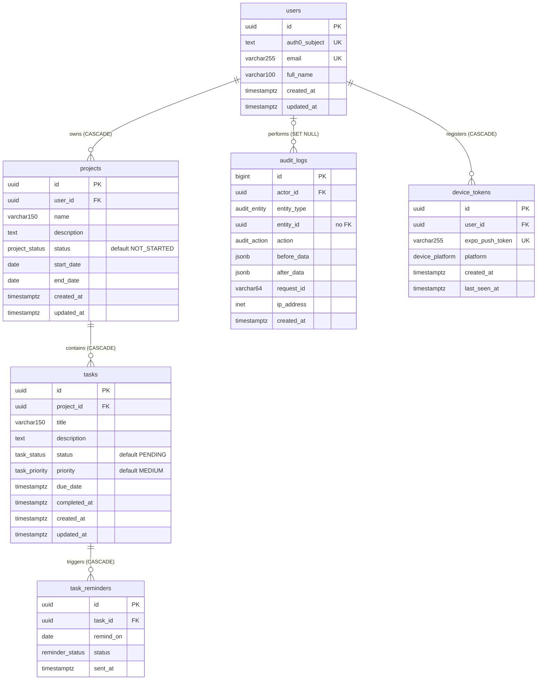

# Database ER Diagram

PostgreSQL · Prisma · Auth0 · Crow's Foot notation · normalized to 3NF / BCNF

> Full-size files:  (vector, zoomable) and .
> **Solid cards** are the core schema. **Dashed cards** are optional roadmap tables (audit logs, push notifications), added only if implemented.

---

## 1. Entities

| Table | Purpose |
|---|---|
| `users` | Application user, linked to the Auth0 identity through `auth0_subject`. |
| `projects` | A project owned by exactly one user. |
| `tasks` | A task belonging to exactly one project. |
| `audit_logs` *(optional)* | Append-only record of who changed what. |
| `device_tokens` *(optional)* | Mobile devices registered for push notifications. |
| `task_reminders` *(optional)* | Scheduled "due tomorrow" notifications. |

Auth0 (identity) and Redis (cache, rate limiting) are infrastructure and are **not** tables.

## 2. Relationships and delete rules

| Relationship | Cardinality | ON DELETE |
|---|---|---|
| `users` owns `projects` | 1 : 0..N | CASCADE |
| `projects` contains `tasks` | 1 : 0..N | CASCADE |
| `users` performs `audit_logs` *(optional)* | 0..1 : 0..N | SET NULL |
| `users` registers `device_tokens` *(optional)* | 1 : 0..N | CASCADE |
| `tasks` triggers `task_reminders` *(optional)* | 1 : 0..N | CASCADE |

There is **no** `users → tasks` foreign key. A task belongs to the owner of its project:
`tasks.project_id → projects.user_id → users.id`.

## 3. Enums (native PostgreSQL ENUM types)

| Enum | Values | Default | Used by |
|---|---|---|---|
| `project_status` | `NOT_STARTED`, `IN_PROGRESS`, `COMPLETED` | `NOT_STARTED` | `projects.status` |
| `task_status` | `PENDING`, `IN_PROGRESS`, `COMPLETED` | `PENDING` | `tasks.status` |
| `task_priority` | `LOW`, `MEDIUM`, `HIGH` | `MEDIUM` | `tasks.priority` |

## 4. Constraints and indexes

| Table | Kind | Definition |
|---|---|---|
| users | PK / UNIQUE | `id`; `auth0_subject`; `email` |
| users | CHECK | `length(trim(full_name)) > 0` |
| projects | PK / FK | `id`; `user_id → users(id) ON DELETE CASCADE` |
| projects | CHECK | `length(trim(name)) > 0`; `end_date >= start_date` when both are set |
| projects | INDEX | `(user_id)` |
| projects | OPTIONAL INDEX | `(user_id, status)` only if the status filter is frequent |
| tasks | PK / FK | `id`; `project_id → projects(id) ON DELETE CASCADE` |
| tasks | CHECK | `length(trim(title)) > 0`; `(status = 'COMPLETED') = (completed_at IS NOT NULL)` |
| tasks | INDEX | `(project_id)` |
| tasks | OPTIONAL INDEX | `(project_id, status)`, `(project_id, priority)` |
| task_reminders | UNIQUE | `(task_id, remind_on)` |
| audit_logs | INDEX | `(entity_type, entity_id, created_at)` |
| device_tokens | UNIQUE / INDEX | `expo_push_token`; `(user_id)` |

## 5. Normalization

| Form | How the schema satisfies it |
|---|---|
| UNF | One wide row holding user, project and `task1..taskN` (repeating groups). |
| 1NF | Atomic values only. Projects and tasks are rows, never lists in a column. |
| 2NF | Every table has a single-column UUID primary key, so partial dependencies are impossible. |
| 3NF | No transitive dependencies: `task → project → user`. No owner name or email is copied onto projects or tasks. |
| BCNF | Every determinant is a candidate key: `id`, `auth0_subject`, `email`, `(task_id, remind_on)`. |

Deliberate decisions:

- Status and priority are native enums, not lookup tables. The value sets are fixed, so a join adds nothing.
- Dashboard counts are `COUNT` queries (cached in Redis), never stored counters.
- `audit_logs.entity_id` has no FK on purpose, so history survives deletions.

## 6. Requirement traceability

| Requirement | Column |
|---|---|
| Full Name / Email / Password | `users.full_name`, `users.email`, password held by Auth0 |
| Project Name, Description, Status, Start, End, Created | `projects.name`, `description`, `status`, `start_date`, `end_date`, `created_at` |
| Task Name, Description, Priority, Status, Due, Created | `tasks.title`, `description`, `priority`, `status`, `due_date`, `created_at` |
| Dashboard: Total Projects / Tasks | `COUNT(projects)`, `COUNT(tasks)` scoped through the owner |
| Dashboard: Completed / Pending / In Progress | `tasks.status`, `projects.status` |
| Search and filters | `projects.name`, `tasks.title`, `status`, `priority` |

## 7. Authorization (what the ERD guarantees)

- `user_id` always comes from the validated JWT, never from the request body, query or UI.
- Reads are scoped through ownership: `tasks → projects.user_id = :currentUser`.
- Another user's project or task returns **404**, so IDs cannot be probed.

## 8. Text version (Mermaid, renders on GitHub)

