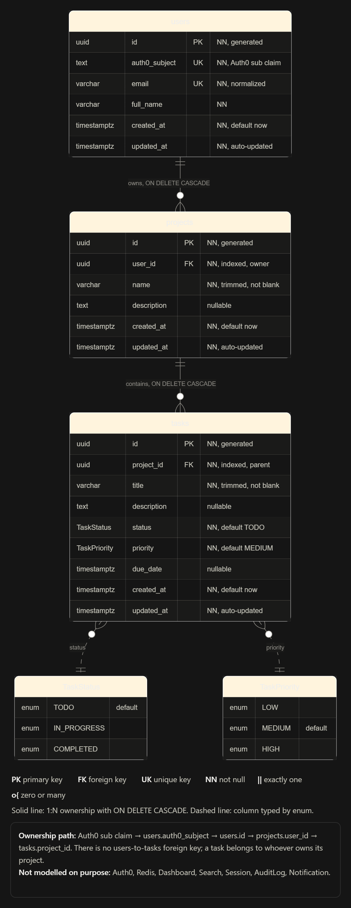

# Project Management System

## Overview
A comprehensive project management system that allows users to create and manage projects and tasks. It provides a real-time dashboard, task management, and project tracking across Web and Native Android platforms.

## Live Demo & Project Links
- **Web Application:** [project-management-system-chi-black.vercel.app](https://project-management-system-chi-black.vercel.app/)
- **Android App Download / Build Page:** [Expo Build Page](https://expo.dev/accounts/akashsingh2127/projects/project-management-mobile/builds/d71e8fb2-0f5c-4247-b36a-0b8f16b9bad0)
- **Project Demonstration Video:** [Google Drive Video](https://drive.google.com/file/d/1npgNhWBejNugM2ZWwpQJXwvgCLfBlx4y/view?usp=drive_link)
- **Backend API:** [pms-api-v7p7.onrender.com](https://pms-api-v7p7.onrender.com)

## Key Features Implemented
- **Authentication**: Secure login using Auth0 for both Web and Mobile platforms.
- **Projects**: Create, view, update, and delete projects.
- **Tasks**: Create tasks within projects, mark them as pending, in progress, or completed, and delete tasks.
- **Dashboard**: Overview of total projects, tasks in progress, and completed tasks.
- **History**: View completed tasks.
- **Cross-Platform**: Full support for both Web browsers and Android mobile devices.

## Technology Stack
- **Monorepo**: npm workspaces
- **Frontend (Web)**: React, Vite, Tailwind CSS
- **Mobile (Android)**: React Native, Expo, NativeWind
- **Backend (API)**: Node.js, Express, TypeScript
- **Database**: PostgreSQL with Prisma ORM
- **Caching & Rate Limiting**: Redis
- **Authentication**: Auth0

## System Architecture & Repository Structure
The project is structured as an npm workspaces monorepo:
```text
project-management-system/
├── apps/
│   ├── api/      # Express backend with Prisma & Redis
│   ├── web/      # React SPA (Vite)
│   └── mobile/   # React Native Android app (Expo)
├── packages/
│   ├── common/   # Shared types, Zod schemas, and constants
│   ├── eslint-config/
│   └── tsconfig/
├── docker/       # Docker configuration for local dev
└── docs/         # Architecture and database documentation
```

## Database Schema / ER Diagram

Below is the Entity-Relationship Diagram for the project. For more details on constraints, indexing, and normalization, see the [Detailed Database Schema Documentation](docs/database/ER_DIAGRAM1.md).

[](docs/database/ER_DIAGRAM1.md)

*Note: The old `docs/database/ER_DIAGRAM.md` and `docs/database/database-design.md` remain available for historical context, but `ER_DIAGRAM1.md` reflects the current primary schema documentation.*

## Authentication and Authorization
Authentication is handled via Auth0:
- **Web App**: Uses `@auth0/auth0-react` for SPA authentication.
- **Mobile App**: Uses `react-native-auth0` for native authentication via custom URI schemes.
- **Backend API**: Validates the JWT Bearer token using `express-oauth2-jwt-bearer`. All endpoints require a valid token, and users are automatically mapped or created based on their Auth0 Subject (`sub`) upon their first authenticated request. Read operations are strictly scoped to resources owned by the authenticated user.

## Web and Mobile Applications
- **Web**: A Single Page Application (SPA) built with React 19 and Vite. Styled with Tailwind CSS and Radix UI components. Deployed to Vercel.
- **Mobile**: A React Native application built with Expo (EAS Build) and NativeWind. Uses `@tanstack/react-query` for data fetching and caching.

## Setup & Local Development

### 1. Docker Setup (Database & Redis)
Ensure Docker is running, then start the local PostgreSQL database and Redis server:
```sh
docker-compose up -d
```

### 2. Install Dependencies
Install all monorepo dependencies from the root directory:
```sh
npm install
```

### 3. Database / Prisma Setup
Navigate to the API app and run Prisma migrations to initialize your local database:
```sh
cd apps/api
npx prisma migrate dev
```

### 4. Backend Setup
Start the API server from the root directory:
```sh
npm run dev --workspace=@project-management/api
```

### 5. Web Setup
Start the web frontend:
```sh
npm run dev --workspace=@project-management/web
```

### 6. Mobile Setup (Android)
To run the Android app, start the Expo development server:
```sh
cd apps/mobile
npx expo start -c
```
*Note: The mobile app uses native modules (like Auth0 and DateTimePicker) and requires a custom development build or running directly on a physical device/emulator via `npx expo run:android` rather than Expo Go.*

## Environment Variables
The application requires specific environment variables to function correctly. **Never expose secret values in version control.**

### Backend (`.env` in root or `apps/api`)
- `PORT`: Port for the API server (e.g., `3000`).
- `DATABASE_URL`: PostgreSQL connection string.
- `REDIS_URL`: Redis connection string.
- `AUTH0_AUDIENCE`: Auth0 API Audience (e.g., `https://project-management-api`).
- `AUTH0_ISSUER_BASE_URL`: Auth0 Tenant URL (e.g., `https://your-tenant.us.auth0.com/`).
- `WEB_URL`: Allowed CORS origin for the web app.

### Web (`apps/web/.env`)
- `VITE_AUTH0_DOMAIN`: Auth0 Tenant Domain.
- `VITE_AUTH0_CLIENT_ID`: Auth0 Web SPA Client ID.
- `VITE_AUTH0_AUDIENCE`: Auth0 API Audience.
- `VITE_API_URL`: Backend API Base URL.

### Mobile (`apps/mobile/eas.json` for cloud builds, or `.env` for local dev)
- `EXPO_PUBLIC_API_URL`: Backend API Base URL.
- `EXPO_PUBLIC_AUTH0_DOMAIN`: Auth0 Tenant Domain.
- `EXPO_PUBLIC_AUTH0_CLIENT_ID`: Auth0 Native App Client ID.
- `EXPO_PUBLIC_AUTH0_AUDIENCE`: Auth0 API Audience.

## Testing
Run the backend API test suite (ensure you are in the correct workspace):
```sh
npm test --workspace=@project-management/api
```

## Deployment Information
- **Database & Redis**: Must be hosted on a cloud provider (e.g., Neon, Render, AWS).
- **Backend API**: Deployed to [Render](https://render.com). Ensure Prisma migrations are run using `npx prisma migrate deploy` in the production environment.
- **Web App**: Deployed to [Vercel](https://vercel.com) with a rewrite rule to serve `index.html` for client-side routing.
- **Mobile App**: Built and distributed via Expo Application Services (EAS). Ensure the `eas.json` configuration includes correct Auth0 audience and API URL for the desired environment profile.

## Security Considerations
- **Authentication**: JWT token validation on all protected routes via Auth0.
- **Rate Limiting**: Configured using `express-rate-limit` and backed by Redis to protect the API from abuse.
- **HTTP Headers**: Uses `helmet` to set secure HTTP headers on the API.
- **Data Isolation**: Database queries in the API are explicitly scoped by the `userId` attached to the authenticated token.

## Known Limitations & Future Improvements
- **iOS Support**: The mobile application is currently focused on Android. iOS build properties and testing have not yet been established.
- **Role-Based Access Control**: Currently, users own projects outright. A future improvement would add RBAC to allow collaboration within projects.
- **Push Notifications**: Device tokens and reminder logic exist in the schema roadmap but are not actively handling automated push notifications.
