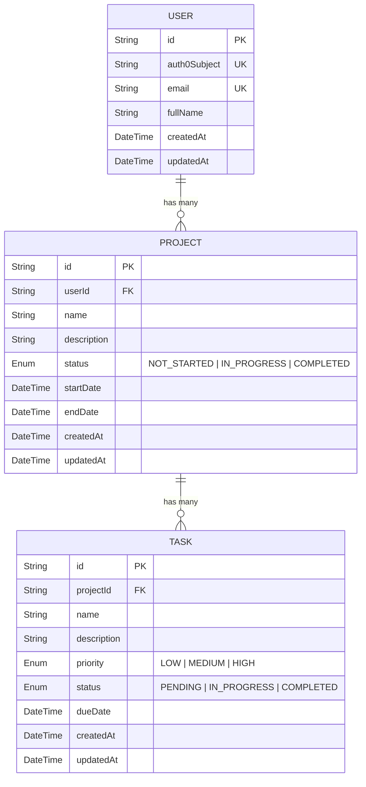

# ER Diagram

```mermaid
erDiagram
    USER {
        String id PK
        String auth0Subject UK
        String email UK
        String fullName
        DateTime createdAt
        DateTime updatedAt
    }

    PROJECT {
        String id PK
        String userId FK
        String name
        String description
        Enum status "NOT_STARTED | IN_PROGRESS | COMPLETED"
        DateTime startDate
        DateTime endDate
        DateTime createdAt
        DateTime updatedAt
    }

    TASK {
        String id PK
        String projectId FK
        String name
        String description
        Enum priority "LOW | MEDIUM | HIGH"
        Enum status "PENDING | IN_PROGRESS | COMPLETED"
        DateTime dueDate
        DateTime createdAt
        DateTime updatedAt
    }

    USER ||--o{ PROJECT : "has many"
    PROJECT ||--o{ TASK : "has many"
```
